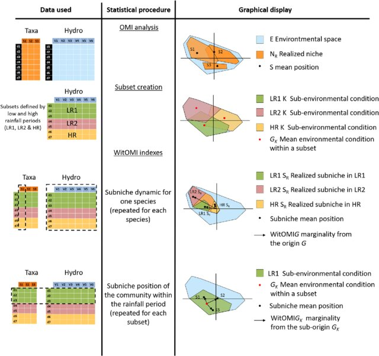
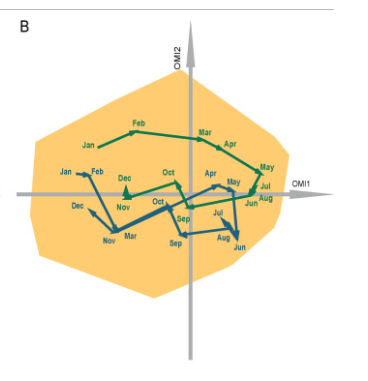
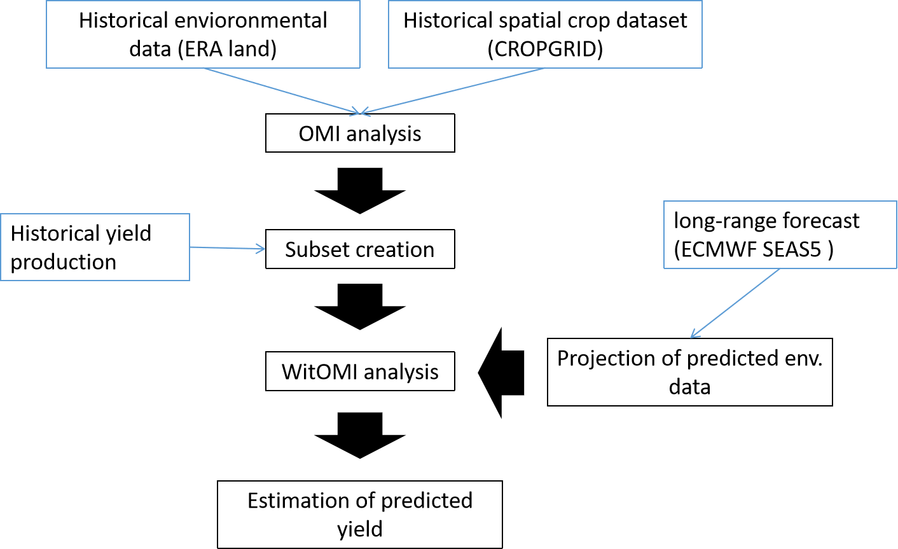

<!-- rmarkdown v1 -->
# Question:

Suppose you have the yield data for various crops in a country for the last 20 years, how would you create a yield prediction algorithm without in-situ data? What satellite, data sources, models, AI models, statistics would you use? Please describe how your algorithm would work.

# Answer:

If I were to build a model that would help predict the yield of various crops. I would 1. try to understand the relationship between the environmental factors and the yield of the different types of crops, then 2. extract the environmental conditions within which the different crops have low, medium and high yield. After the assessment is done, 3. the prediction be done on the future environmental conditions with existing meteorological forecasting model and finally 4. linking the predicted environment with the first two assessments in order to have an estimate of the crop yield. 

The first part is an evaluation study, which would imply using the yield data of the last 20 years, but also for the same period the past environmental conditions, which implies the set of factors that are known to affect the crop species studied, (soil moisture, temperature, precipitation,...). The source of the environmental data can come from satellite images, such as ERA land.  The crop spatial distribution map could be extracted from a global dataset such as CROPGRIDS (Tang, 2023). Assuming that the spatial coverage of the crop data is similar to that of the environmental data, an Outlying Mean Index (OMI) analysis can be performed (Dolédec et al., 2000). The analysis would give us an overview of the mean crop distribution (or niche) within the 20 years of environmental conditions and its relation to the different environmental factors.  A detailed description of the niche of the different crop species would provide insight into the common or different environmental factors affecting their distribution over the 20 years.

The second step would be to use the crop yield data to create three subsets of environmental conditions. These would be defined by low, medium and high yield productivity for each crop species. The sub-environments would provide a range of conditions within which the crop had managed to produce low, medium and high yields respectively. The Within Outlying Mean Index (WitOMI) combines the subsets of environmental conditions and the results of the OMI analysis. The results of the WitOMI give us a detailed description of the crop performance under each of the subsets of conditions (subniche). Therefore, for each crop species, you would have three subniches that also give us clues on the commonality or atypical condition under which the crop grows to achieve the expected yield.  A conceptual summary of the analyses can be seen in Figure 1. 

In order to predict crop yields in the future, it is easier to predict the environment in which the crop will grow and then estimate the potential yield production based on past observations.  The data on future environmental conditions can be extracted from the long-range forecast product generated by the ECMWF SEAS5 system, the fifth generation seasonal forecasting system that became operational in November 2017 (Johnson et al., 2019). In the hypothesis that the studied environmental factor is the same as in the forecast data of the studied region, the data can be projected in the environmental space generated by the OMI analysis in order to have, in the same Euclidean space, the observed and the predicted data. 

Having projected the predicted data, it would now be possible to follow the trajectory of the predicted environment of the different crop species. As shown in the figure below

Figure 2 Extracted from Figure 5B Karasiewicz et al, 2018, the arrows represent the average monthly environmental trajectory of two subsets of environmental conditions. 

In our case, the crop subsets would be drawn on the Euclidean space, giving us a visual indication of the potential predicted yield. The predicted yield values would be based on historical in-situ data, which would be closest to the projected and predicted environmental data. 

In conclusion the process would look like the figure below:

# References 

Sylvain Doledec, Daniel Chessel, Clementine Gimaret-Carpentier Ecology, Vol. 81, No. 10 (Oct., 2000), pp. 2914-2927, https://doi.org/10.2307/177351.

Karasiewicz S, Dolédec S, Lefebvre S. 2017. Within outlying mean indexes: refining the OMI analysis for the realized niche decomposition. PeerJ 5:e3364 https://doi.org/10.7717/peerj.3364

Karasiewicz, S., Breton, E., Lefebvre, A., Fariñas, T. H., & Lefebvre, S. (2018). Realized niche analysis of phytoplankton communities involving HAB: Phaeocystis spp. as a case study. Harmful Algae, 72, 1-13.

Tang, F. H. M., Nguyen, T. H., Conchedda, G., Casse, L., Tubiello, F. N., and Maggi, F.: CROPGRIDS: A global geo-referenced dataset of 173 crops circa 2020, Earth Syst. Sci. Data Discuss. [preprint], https://doi.org/10.5194/essd-2023-130, 2023.

Johnson, S. J., Stockdale, T. N., Ferranti, L., Balmaseda, M. A., Molteni, F., Magnusson, L., Tietsche, S., Decremer, D., Weisheimer, A., Balsamo, G., Keeley, S. P. E., Mogensen, K., Zuo, H., and Monge-Sanz, B. M.: SEAS5: the new ECMWF seasonal forecast system, Geosci. Model Dev., 12, 1087–1117, https://doi.org/10.5194/gmd-12-1087-2019, 2019. 

Saccò, M, Blyth, AJ, Humphreys, WF, et al. Stygofaunal community trends along varied rainfall conditions: Deciphering ecological niche dynamics of a shallow calcrete in Western Australia. Ecohydrology.  202
